# Shopping Assistant AI Agents Architecture

This document explains the technical architecture, components, and data flow of the Shopping Assistant AI Agents project. The project is an agent-based system built on LangChain and local LLMs (via Ollama) to help users create ingredient lists for recipes.

## High-Level Diagram

```mermaid
%%{
  init: {
    "theme": "base",
    "themeVariables": {
      "primaryColor": "#b9cea9",
      "primaryTextColor": "#1b1b1b",
      "primaryBorderColor": "#1b1b1b",
      "lineColor": "#F8B229",
      "secondaryColor": "#b9cea9",
      "tertiaryColor": "#ffffff"
    }
  }
}%%

graph TD
    subgraph "1. User Interaction"
        A[👤 User] -->|"Input: 'I want to make menemen' or 'ideas for dinner'"| B(main.py);
    end

    subgraph "2. Orchestration & Logic"
        FileNode2["(File: agent.py)"];
        style FileNode2 fill:none,stroke:none,font-style:italic,color:#666;
        
        B -->|"Run workflow"| C[OrchestratorAgent];
        C -->|"1. Route Intent (LLM)"| D{Intent?};
        D -- "provide_dishes" --> E["Identify Dishes (LLM)"];
        D -- "request_ideas" --> F["Suggest Meals (LLM)"];
        D -- "suggest_dish_from_ingredients" --> G["Suggest Dish (LLM)"];
        E --> H[Call Tool: get_ingredients];
        F --> A;
        G --> A;
    end

    subgraph "3. Tools & Data Access"
        FileNode3["(File: tools.py)"];
        style FileNode3 fill:none,stroke:none,font-style:italic,color:#666;

        H --> I[🛠️ get_ingredients_for_dish];
        I -->|"Check Cache"| J{🗄️ MongoDB};
        J -- "Recipe Exists" --> K[Return to Orchestrator];
        J -- "Recipe Not Found" --> L["🌐 Web Search (DDGS)"];
        L --> M["Scrape Page (BeautifulSoup)"];
        M -->|"Raw Ingredient Text"| N["Clean Ingredients (LLM)"];
        N -->|"Clean List"| O[Save to Cache];
        O --> K;
    end

    subgraph "4. List Finalization"
        FileNode4["(File: main.py & agent.py)"];
        style FileNode4 fill:none,stroke:none,font-style:italic,color:#666;

        K -->|"Collect Results"| P(main.py);
        P -->|"Consolidate Lists (ConsolidatorAgent)"| Q[🛒 Consolidated Shopping List];
        Q -->|"Show for Modification"| A;
        A -->|"Add/Remove Items"| Q;
        A -- "Finished" --> R[✅ Final Shopping List];
    end

    subgraph "5. Price Comparison (Optional)"
        FileNode5["(File: main.py & tools.py)"];
        style FileNode5 fill:none,stroke:none,font-style:italic,color:#666;

        R --> S{"Ask for price check"};
        S -- "User says 'yes'" --> T["Loop: For each item in list"];
        T --> U[Call 🛠️ get_price_info];
        U --> V["🌐 Web Search (DDGS)"];
        V --> W["Scrape Price (BS4)"];
        W --> T;
        T -- "Loop finished" --> X["📊 Aggregate & Display Results"];
        X --> A;
        S -- "User says 'no'" --> Y((End));
    end
```

