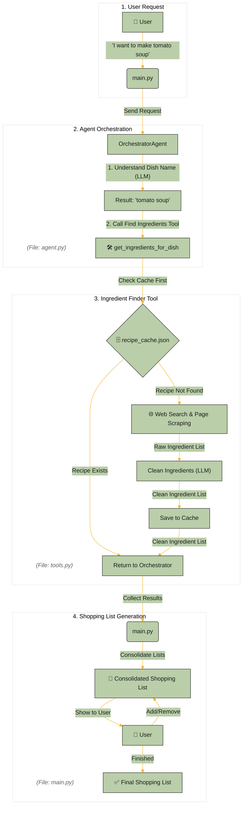

# Project Architecture

This diagram illustrates the workflow of the Shopping Assistant AI Agents project.

```mermaid
%%{
  init: {
    "theme": "base",
    "themeVariables": {
      "primaryColor": "#b9cea9",
      "primaryTextColor": "#1b1b1b",
      "primaryBorderColor": "#1b1b1b",
      "lineColor": "#F8B229",
      "secondaryColor": "#b9cea9",
      "tertiaryColor": "#ffffff"
    }
  }
}%%

graph TD
    subgraph "1. User Request"
        A[👤 User] -->|"'I want to make tomato soup'"| B(main.py);
    end

    subgraph "2. Agent Orchestration"
        FileNode2["(File: agent.py)"];
        style FileNode2 fill:none,stroke:none,font-style:italic,color:#666;
        
        B -->|"Send Request"| C[OrchestratorAgent];
        C -->|"1. Understand Dish Name (LLM)"| D["Result: 'tomato soup'"];
        D -->|"2. Call Find Ingredients Tool"| E[🛠️ get_ingredients_for_dish];
    end

    subgraph "3. Ingredient Finder Tool"
        FileNode3["(File: tools.py)"];
        style FileNode3 fill:none,stroke:none,font-style:italic,color:#666;

        E -->|"Check Cache First"| F{🗄️ recipe_cache.json};
        F -- "Recipe Exists" --> G[Return to Orchestrator];
        F -- "Recipe Not Found" --> H["🌐 Web Search & Page Scraping"];
        H -->|"Raw Ingredient List"| I["Clean Ingredients (LLM)"];
        I -->|"Clean Ingredient List"| J[Save to Cache];
        J -->|"Clean Ingredient List"| G;
    end

    subgraph "4. Shopping List Generation"
        FileNode4["(File: main.py)"];
        style FileNode4 fill:none,stroke:none,font-style:italic,color:#666;

        G -->|"Collect Results"| K(main.py);
        K -->|"Consolidate Lists"| L[🛒 Consolidated Shopping List];
        L -->|"Show to User"| M[👤 User];
        M -->|"Add/Remove"| L;
        M -- "Finished" --> N[✅ Final Shopping List];
    end
```