# Shopping Assistant AI Agents

This project is a conversational AI agent system designed to assist users with their meal planning and shopping. Built with Python, LangChain, and local Large Language Models (LLMs) via Ollama, it can understand user requests, find recipes, extract ingredients, create consolidated shopping lists, and even compare item prices.

## Key Features

*   **Conversational Intent Recognition:** Understands whether the user wants to find a specific recipe, needs meal ideas, or wants suggestions based on available ingredients.
*   **Dynamic Recipe Search:** Searches the web for recipes if they are not found in a local cache.
*   **Intelligent Web Scraping:** Extracts ingredient lists from recipe websites, prioritizing structured data (JSON-LD, Microdata) for accuracy before falling back to HTML tag analysis.
*   **LLM-Powered Data Cleaning:** Uses an LLM to parse raw, scraped text into a structured JSON format (`{quantity, unit, name}`).
*   **Database Caching:** Caches successfully found recipes in a MongoDB database to speed up future requests.
*   **Robustness & Fallbacks:** Automatically switches to a simpler LLM (`gemma:2b`) if the primary model (`gemma3`) fails, ensuring higher availability.
*   **Shopping List Management:** Consolidates ingredients from multiple recipes into a single shopping list and allows the user to interactively add or remove items.
*   **Optional Price Comparison:** Can search for prices of items on the final shopping list across specified online stores.

## Architecture

The system is composed of several agents and tools that collaborate to fulfill a user's request. The `OrchestratorAgent` is the main entry point that routes tasks based on user intent.

For a more visual representation, you can refer to the Mermaid diagram below, which illustrates the data flow from user input to the final shopping list.

### Core Components

1.  **`main.py` (User Interface & Main Loop):**
    *   **Entry Point:** Serves as the command-line interface for the user.
    *   **State Management:** Manages the conversational flow, presenting suggestions, and handling user choices.
    *   **Agent Invocation:** Instantiates and calls the `OrchestratorAgent` and `ShoppingListConsolidatorAgent`.
    *   **Interactive List:** Allows the user to interactively add or remove items from the consolidated shopping list before finalizing it.

2.  **`agent.py` (The "Brains"):**
    *   **`OrchestratorAgent`:** The central coordinator. It uses a series of LLM-powered chains to:
        *   **Route Intent:** Determines if the user wants a specific dish, needs ideas, or has ingredients.
        *   **Delegate Tasks:** Based on the intent, it runs other chains to identify dish names, suggest meals, or extract ingredients from the user's prompt.
        *   **Execute Tools:** Calls the `get_ingredients_for_dish` tool to fetch recipe data from the web or database.
    *   **`ShoppingListConsolidatorAgent`:** A specialized agent that takes ingredient lists from multiple recipes and merges them into a single, clean shopping list. It attempts to sum quantities for items with compatible units.

3.  **`tools.py` (The "Hands and Senses"):**
    *   **`get_ingredients_for_dish` (Tool):**
        *   **Caching:** First checks a MongoDB database for a cached version of the recipe to avoid redundant web searches.
        *   **Web Search:** If not cached, uses `duckduckgo-search` to find relevant recipe URLs.
        *   **Web Scraping (`_find_ingredients_from_url`):** Intelligently scrapes ingredient data from a URL using a multi-step approach for robustness:
            1.  Looks for structured **JSON-LD** data (most reliable).
            2.  Looks for **Microdata** (schema.org).
            3.  Analyzes HTML structure (e.g., a list following an "Ingredients" heading).
            4.  Falls back to searching for common CSS class names.
        *   **Data Cleaning (LLM):** Uses a dedicated LLM chain to parse the messy, scraped text into a clean, structured JSON format (`{quantity, unit, name}`).
    *   **`get_price_info` (Tool):** An optional tool that searches for the price of a given shopping list item on specified e-commerce websites.

### Data Flow Diagram

```mermaid
%%{
  init: {
    "theme": "base",
    "themeVariables": {
      "primaryColor": "#b9cea9",
      "primaryTextColor": "#1b1b1b",
      "primaryBorderColor": "#1b1b1b",
      "lineColor": "#F8B229",
      "secondaryColor": "#b9cea9",
      "tertiaryColor": "#ffffff"
    }
  }
}%%

graph TD
    subgraph "1. User Interaction"
        A[👤 User] -->|"Input: 'I want to make tomato soup' or 'ideas for dinner'"| B(main.py);
    end

    subgraph "2. Orchestration & Logic"
        B -->|"Run workflow"| C[OrchestratorAgent];
        C -->|"1. Route Intent (LLM)"| D{Intent?};
        D -- "provide_dishes" --> E["Identify Dishes (LLM)"];
        D -- "request_ideas" --> F["Suggest Meals (LLM)"];
        D -- "suggest_dish_from_ingredients" --> G["Suggest Dish (LLM)"];
        E --> H[Call Tool: get_ingredients];
    end

    subgraph "3. Tools & Data Access"
        H --> I[🛠️ get_ingredients_for_dish];
        I -->|"Check Cache"| J{🗄️ MongoDB};
        J -- "Recipe Exists" --> K[Return to Orchestrator];
        J -- "Recipe Not Found" --> L["🌐 Web Search (DDGS)"];
        L --> M["Scrape Page (BeautifulSoup)"];
        M -->|"Raw Ingredient Text"| N["Clean Ingredients (LLM)"];
        N -->|"Clean List"| O[Save to Cache];
        O --> K;
    end

    subgraph "4. List Finalization"
        K -->|"Collect Results"| P(main.py);
        P -->|"Consolidate Lists (ConsolidatorAgent)"| Q[🛒 Consolidated Shopping List];
        Q -->|"Show for Modification"| A;
    end
```



## Prerequisites

*   **Python 3.8+**
*   **Ollama:** You must have Ollama installed and running.
*   **Ollama Models:** The project requires the following models. You can pull them by running:
    ```sh
    ollama pull gemma3
    ollama pull gemma:2b
    ```
*   **MongoDB (Optional):** For recipe caching. You can use a local instance or a free cloud-based service like MongoDB Atlas.

## Installation

1.  **Clone the repository:**
    ```sh
    git clone <your-repository-url>
    cd ShoppingAssistantAIAgents
    ```

2.  **Create and activate a virtual environment:**
    ```sh
    python -m venv venv
    # On Windows
    .\venv\Scripts\activate
    # On macOS/Linux
    source venv/bin/activate
    ```

3.  **Install the dependencies:**
    ```sh
    pip install -r requirements.txt
    ```

4.  **Set up environment variables:**
    Create a file named `.env` in the root directory and add your MongoDB connection string if you are using it:
    ```
    MONGO_URI="your_mongodb_connection_string"
    ```
    If you leave this out, the database caching feature will be disabled.

## Usage

1.  Make sure your Ollama service is running in the background.
2.  Run the main application script:
    ```sh
    python main.py
    ```
3.  Interact with the assistant through the command line. Here are some examples:
    *   **Get a specific recipe:** `I want to make spaghetti carbonara and a garden salad`
    *   **Ask for ideas:** `What should I cook for dinner tonight?`
    *   **Get a suggestion from ingredients:** `I have chicken, potatoes, and carrots, what can I make?`

## Technology Stack

*   **Core:** Python
*   **AI/LLM:** LangChain, Ollama
*   **Web Scraping:** DuckDuckGo Search (for search), BeautifulSoup4 (for parsing)
*   **Database:** MongoDB (via `pymongo`)
*   **Utilities:** `python-dotenv`, `deep_translator`